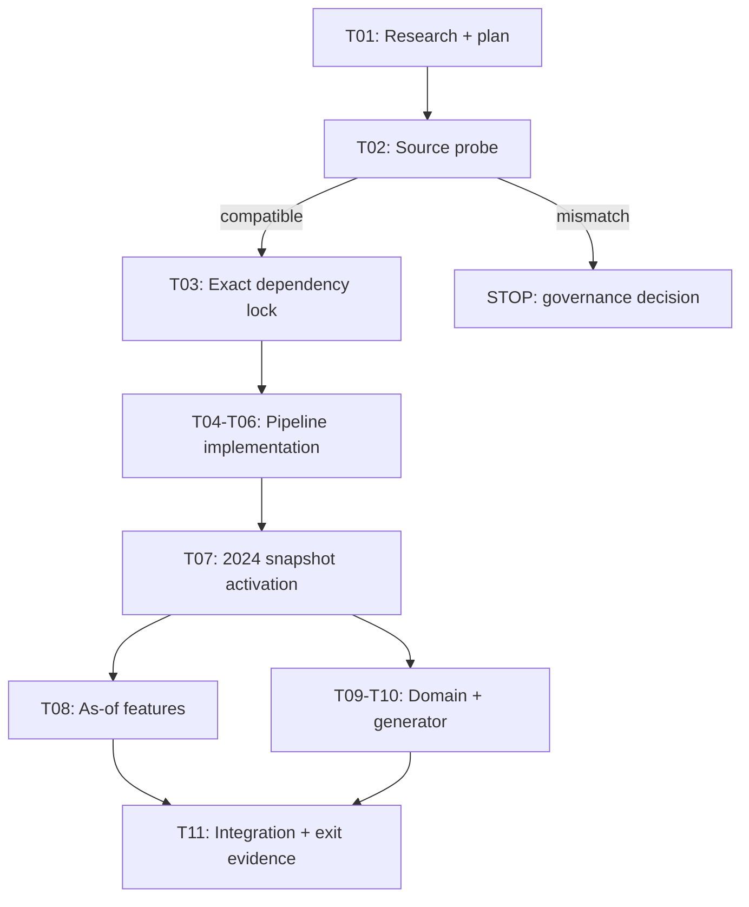
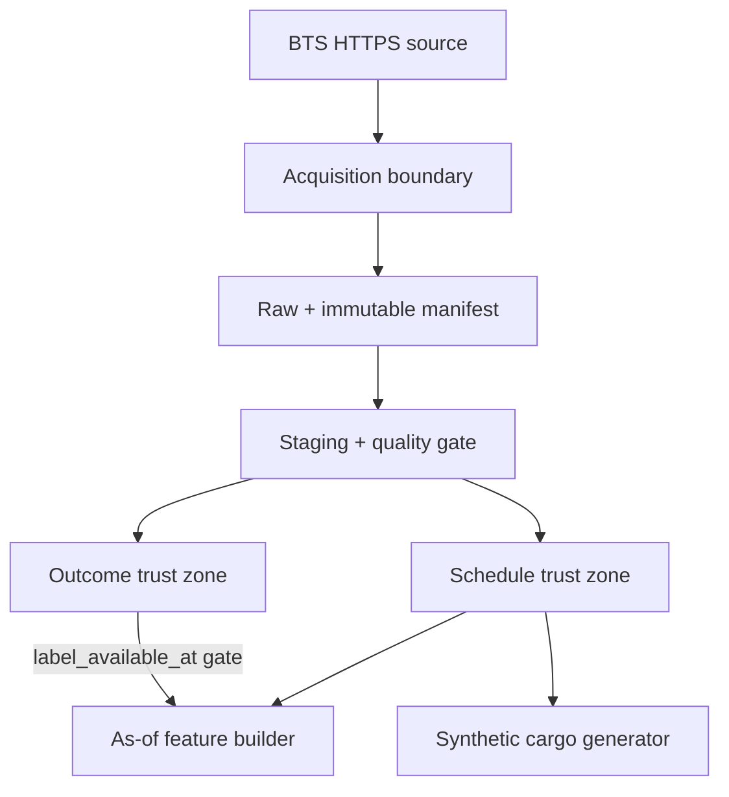

# Phase 2 Data ve Domain Uygulama Planı

| Alan | Değer |
|---|---|
| Belge kimliği | `phase-2-implementation-plan-v1` |
| Görev | `PH2-T01` |
| Plan tarihi | `2026-08-15` |
| Durum | `APPROVED — PH2-T02 PLANNING AUTHORIZED` |
| Onay | `2026-08-15` — explicit user command |
| Kapsam | Yalnız Phase 2 data/domain ve leakage-safe feature foundation |
| Implementation durumu | **Başlamadı** |

## 1. Phase 2 teslim hedefi

Phase 2 sonunda sistem:

1. yalnız resmî BTS kaynağından provenance/hash kontrollü 2024 uçuş
   snapshot'ı üretir;
2. schedule/input ile outcome/label'ı fiziksel ve mantıksal olarak ayırır;
3. timezone-aware UTC zamanlarını, train-only top-20 evrenini ve frozen split'i
   üretir;
4. T-24/T-18/T-12/T-6 cutoff'larında leakage-safe 7/30 günlük feature
   foundation'ını üretir;
5. gerçek şirket verisi kullanmadan, accepted contract'a göre byte-stable
   sentetik cargo/capacity snapshot'ı üretir;
6. source, quality, leakage, determinism ve domain invariant kanıtlarını hosted
   CI ile doğrular.

Phase 2 model fit etmez, OR problemi çözmez, API/UI kurmaz ve RAG/LLM işi
yapmaz.

## 2. Faz içi kapı akışı



Her ok bir precondition'dır. Bir görev `COMPLETED` olmadan ardındaki görevin
task dosyası, dependency'si, dizini, interface'i, TODO'su veya placeholder'ı
oluşturulmaz. Her task önce planlanır, kullanıcıya sunulur ve ancak ayrı exact
yürütme onayıyla başlatılır.

## 3. Mimari sınırlar



Temel kurallar:

- Network yalnız acquisition komutunda açıktır; transform ve testler offline'dır.
- Raw source read-only'dir. Pipeline hiçbir raw byte'ı düzeltmez.
- Schedule reader outcome dosya yolunu veya kolonlarını göremez.
- Feature builder outcome'a yalnız internal as-of gateway üzerinden erişir.
- Generator prediction, probability, outcome veya solver sonucu okuyamaz.
- Immutable Parquet/JSON + manifest truth source'tur; DuckDB database dosyası
  kalıcı system-of-record değildir.

## 4. Task kataloğu

Bu katalog PH2-T01 plan sonucudur. Görevler kullanıcı onayıyla sırayla task
contract'ına dönüştürülür; şu anda yalnız `PH2-T01.yaml` vardır.

| Task | Tek sorumluluk | Network | Dependency mutation | Kalıcı data | Başarı çıktısı |
|---|---|---:|---:|---:|---|
| `PH2-T02` | Resmî source/right/exact-15 compatibility probe | Bounded read-only | Hayır | Hayır | `SOURCE_COMPATIBLE` report |
| `PH2-T03` | Exact Phase 2 dependency lock ve supply-chain doğrulaması | PyPI/uv | Evet | Hayır | Frozen/audited lock |
| `PH2-T04` | Acquisition client ve immutable provenance manifest | Test fixture only | Hayır | Hayır | Fixture-backed source boundary |
| `PH2-T05` | Exact staging schema ve data-quality gate | Hayır | Hayır | Hayır | Fail-closed quality engine |
| `PH2-T06` | Timezone, flight materialization ve universe/split algoritması | Hayır | Hayır | Hayır | Schedule/outcome processor |
| `PH2-T07` | Full 2024 snapshot acquisition ve activation | Bounded official BTS | Hayır | Evet, ignored local | Active dataset manifest |
| `PH2-T08` | Leakage-safe multi-horizon feature foundation | Hayır | Hayır | Derived artifact | Feature snapshot evidence |
| `PH2-T09` | Cargo domain value objects ve invariant validator | Hayır | Hayır | Hayır | Strict domain boundary |
| `PH2-T10` | Deterministic synthetic cargo/capacity generator | Hayır | Hayır | Golden fixture | Byte-stable generator |
| `PH2-T11` | Phase 2 integration, clean-room, hosted CI ve exit report | GitHub hosted CI | Hayır | Evidence only | `READY_FOR_HUMAN_APPROVAL` |

## 5. Task-by-task exact plan

### 5.1 PH2-T02 — Source compatibility probe

**Precondition:** PH2-T01 `COMPLETED`; proposed plan/toolchain açıkça kabul
edilmiş; PH2-T02 task planı ayrıca oluşturulmuş ve yürütmesi onaylanmış olmalı.

**Exact repository allowlist:**

- `PROJECT_SPEC.md`
- `docs/phase-status.yaml`
- `docs/tasks/PH2-T02.yaml`
- `docs/data/PHASE_2_SOURCE_COMPATIBILITY_REPORT.md`

**Geçici dış-repository allowlist:** yalnız Ocak 2024 tek source artifact'ı veya
exact 15-field extract'i; header/hash incelemesinden sonra silinir.

**Test/kanıt:** HTTPS/final host, response metadata, byte bound, archive member,
CSV header exact equality, request replayability ve rights/policy source kaydı.

**Stop:** `CONTRACT_SOURCE_MISMATCH`, `RIGHTS_UNRESOLVED`, third-party mirror
gereksinimi, 15 alanı code projection ile elde etme ihtiyacı veya task dışı
kalıcı byte.

### 5.2 PH2-T03 — Dependency lock ve clean-room verification

**Precondition:** PH2-T02 sonucu `SOURCE_COMPATIBLE`.

**Exact repository allowlist:**

- `pyproject.toml`
- `uv.lock`
- `PROJECT_SPEC.md`
- `docs/phase-status.yaml`
- `docs/tasks/PH2-T03.yaml`
- `docs/data/PHASE_2_DEPENDENCY_VERIFICATION.md`

**Tek mutation:** `duckdb==1.5.5`, `airportsdata==20260803`, `tzdata==2026.3`,
`hypothesis==6.165.9`, `sortedcontainers==2.4.0`; extras yok.

**Test/kanıt:** Python 3.14.7 Linux x86_64 wheel, exact lock graph, two frozen
sync idempotency, imports/versions, `uv audit`, SPDX inventory, existing
format/lint/mypy/pytest/build.

**Stop:** proposed graph dışında package, sdist-only requirement, yanked/pre-
release, vulnerability/adverse status, kabul edilmeyen license veya current
foundation regression.

### 5.3 PH2-T04 — Acquisition ve provenance boundary

**Precondition:** PH2-T03 clean-room/audit `PASSED`.

**Exact repository allowlist:**

- `.gitignore`
- `PROJECT_SPEC.md`
- `docs/phase-status.yaml`
- `docs/tasks/PH2-T04.yaml`
- `docs/data/ACQUISITION_RUNBOOK.md`
- `configs/data/bts_reporting_otp_2024.json`
- `src/cargoopt_recovery/data/__init__.py`
- `src/cargoopt_recovery/data/acquisition.py`
- `src/cargoopt_recovery/data/manifests.py`
- `tests/fixtures/bts/exact_15_header.csv`
- `tests/fixtures/bts/wrong_header.csv`
- `tests/test_data_acquisition.py`

**Scope:** stdlib HTTPS client, allowlist/redirect/timeout/retry/byte bounds,
stream hash, atomic write, ZIP safety, canonical manifest. Fixtures sentetiktir;
gerçek BTS data download yoktur.

**Test:** local temporary HTTP fixture server, redirect escape, truncated body,
oversize, duplicate/unsafe ZIP member, CRC failure, same ID/different hash,
atomic cleanup ve canonical manifest hash.

**Stop:** yeni HTTP/archive dependency ihtiyacı, gerçek data gereksinimi veya
fixture testinin internete çıkması.

### 5.4 PH2-T05 — Strict staging ve quality engine

**Precondition:** PH2-T04 `COMPLETED`.

**Exact repository allowlist:**

- `PROJECT_SPEC.md`
- `docs/phase-status.yaml`
- `docs/tasks/PH2-T05.yaml`
- `src/cargoopt_recovery/data/schema.py`
- `src/cargoopt_recovery/data/quality.py`
- `tests/fixtures/bts/valid_rows.csv`
- `tests/fixtures/bts/invalid_rows.csv`
- `tests/fixtures/bts/conflicting_duplicate.csv`
- `tests/test_data_quality.py`

**Scope:** exact header/type parse, canonicalization with raw audit value,
structural rules, duplicate policy, quarantine reason codes/budgets ve quality
report. Timezone dönüşümü ve full snapshot yoktur.

**Test:** tüm reason code'lar, extra/missing/duplicate column, invalid scalar,
NaN/Inf, exact/conflicting duplicate, `0.1%`, `0.5%`, `1.0%` boundary'leri ve
unknown field fatal.

**Stop:** fuzzy rename/coercion, threshold gevşetme, invalid row silerek oranı
geçirme veya accepted quality contract değişikliği.

### 5.5 PH2-T06 — Flight processing, timezone ve universe

**Precondition:** PH2-T05 `COMPLETED`.

**Exact repository allowlist:**

- `PROJECT_SPEC.md`
- `docs/phase-status.yaml`
- `docs/tasks/PH2-T06.yaml`
- `configs/data/airport_timezone_mapping_v1.json`
- `src/cargoopt_recovery/data/timezones.py`
- `src/cargoopt_recovery/data/processing.py`
- `tests/fixtures/bts/processing_rows.csv`
- `tests/fixtures/bts/airport_records.json`
- `tests/test_timezones.py`
- `tests/test_flight_processing.py`

**Scope:** AirportID+code→IANA mapping, `2400`, DST fail-closed, UTC departure/
arrival, canonical flight ID, label/availability, physical schedule/outcome
materialization, frozen split, train-only top-20/hub/destination algorithms.

**Test:** one-to-many airport code, missing zone, invalid IANA zone, DST gap/fold,
arrival local audit mismatch, flight ID collision, train-only selection,
tie-break, exact 20, partition boundaries ve outcome forbidden-column scan.

**Stop:** coordinate/offset tahmini, current airport dataset'i tarihsel gerçek
gibi varsayma, schedule/outcome aynı artifact, Eylül–Aralık ile universe seçme.

### 5.6 PH2-T07 — 2024 data snapshot activation

**Precondition:** PH2-T04–T06 testleri ve hosted Foundation CI `PASSED`; data
download/retention yetkisi task'ta ayrıca açık olmalı.

**Exact tracked repository allowlist:**

- `PROJECT_SPEC.md`
- `docs/phase-status.yaml`
- `docs/tasks/PH2-T07.yaml`
- `docs/data/PHASE_2_DATA_ACTIVATION_REPORT.md`
- `artifacts/data/bts-reporting-otp-2024-v1/source-manifest.json`
- `artifacts/data/bts-reporting-otp-2024-v1/quality-report.json`
- `artifacts/data/bts-reporting-otp-2024-v1/airport-timezone-map.json`
- `artifacts/data/bts-reporting-otp-2024-v1/universe.json`
- `artifacts/data/bts-reporting-otp-2024-v1/activation-manifest.json`

**Exact ignored generated roots:**

- `data/raw/bts/year=2024/month={01..12}/source.zip`
- `data/staging/bts/year=2024/month={01..12}/rows.parquet`
- `data/quarantine/bts/year=2024/month={01..12}/rows.parquet`
- `data/processed/schedule/year=2024/month={01..12}/flights.parquet`
- `data/processed/outcome/year=2024/month={01..12}/outcomes.parquet`

Buradaki `{01..12}` closed expansion'dır; task YAML on iki exact yolu ayrı ayrı
listeler. Başka yıl/ay/path yoktur.

**Scope:** exact code'u değiştirmeden acquisition → quality → processing çalıştır,
manifests/hashes/quality report üret, bütün gates geçerse snapshot'ı `ACTIVE`
yap. Bu task'ta bug fix yapılmaz.

**Test/kanıt:** 12 source hash, row reconciliation, duplicate/quarantine budget,
timezone completeness, schedule/outcome hashes, top-20 hash, clean rerun hash
equality ve raw overwrite prevention.

**Stop:** herhangi ay source/header/hash drift, quality fatal, timezone gap,
nondeterminism veya implementation düzeltmesi ihtiyacı. Hata halinde ayrı
correction task planlanır; aynı task'ta kod ve data birlikte değiştirilmez.

### 5.7 PH2-T08 — Leakage-safe feature foundation

**Precondition:** PH2-T07 snapshot `ACTIVE`.

**Exact repository allowlist:**

- `PROJECT_SPEC.md`
- `docs/phase-status.yaml`
- `docs/tasks/PH2-T08.yaml`
- `configs/data/flight_feature_snapshot_v2.json`
- `src/cargoopt_recovery/data/features.py`
- `tests/fixtures/features/asof_history.json`
- `tests/test_feature_availability.py`
- `artifacts/features/flight-risk-features-v2/contract-report.json`

**Scope:** accepted `flight-feature-availability-v2` exact derived feature
schema; horizons `{24,18,12,6}`; 7/30 gün route/origin/destination/carrier
history; `label_available_at`; prior strength `20`; frozen partition/unseen
category foundation. Model training veya preprocessing fit yoktur.

**Test:** target exclusion, future row, label lag, left/right window boundary,
all horizons, partition grouping, later-horizon leakage, NaN/Inf, rate bounds,
count types, `__UNKNOWN__`, empty history action, shuffled source determinism ve
outcome column absence.

**Stop:** outcome'a serbest join, target label, post-cutoff row, split değişimi,
feature allowlist dışı kolon veya Phase 3 estimator dependency'si.

### 5.8 PH2-T09 — Cargo domain boundary

**Precondition:** PH2-T07 active schedule snapshot; PH2-T08'e bağımlı değildir.

**Exact repository allowlist:**

- `PROJECT_SPEC.md`
- `docs/phase-status.yaml`
- `docs/tasks/PH2-T09.yaml`
- `src/cargoopt_recovery/domain/__init__.py`
- `src/cargoopt_recovery/domain/models.py`
- `src/cargoopt_recovery/domain/validation.py`
- `src/cargoopt_recovery/domain/serialization.py`
- `tests/fixtures/domain/valid_case.json`
- `tests/fixtures/domain/invalid_case.json`
- `tests/test_cargo_domain.py`

**Scope:** strict dataclass/Enum/Decimal value objects, UTC timestamps, IDs,
case/cardinality/eligibility/invariant validation ve canonical JSON. Generator,
ML probability veya OR solver yoktur.

**Test:** all fail-closed states, unknown field/enum, naive time, unit/precision,
destination/window/cold-chain/cardinality, forbidden outcome/prediction fields,
canonical serialization/hash ve input order independence.

**Stop:** Pydantic/API schema, cost/solver implementation, prediction batch
implementation veya accepted domain contract değişikliği.

### 5.9 PH2-T10 — Deterministic synthetic generator

**Precondition:** PH2-T09 `COMPLETED`.

**Exact repository allowlist:**

- `PROJECT_SPEC.md`
- `docs/phase-status.yaml`
- `docs/tasks/PH2-T10.yaml`
- `configs/domain/synthetic_cargo_v1.json`
- `src/cargoopt_recovery/domain/synthetic.py`
- `tests/fixtures/domain/synthetic_golden_input.json`
- `tests/fixtures/domain/synthetic_golden_output.json`
- `tests/test_synthetic_generator.py`
- `tests/property/test_synthetic_invariants.py`
- `artifacts/domain/synthetic-cargo-v1/golden-manifest.json`

**Scope:** stateless SHA-256 uniform, quota/largest-remainder, Decimal weight/
volume, ready/SLA, `BALANCED_110` capacity, cold-chain guarantee, canonical
sort/JSON/hash. Real company data ve outcome/prediction access yoktur.

**Test:** same input byte-identical, shuffled candidates identical, `200 →
140/40/20`, 50/500 boundaries, ranges/precision, capacity reconciliation,
positive values, cold-chain guarantee, forbidden input fields, different
seed/case hash behavior ve Hypothesis invariant profile.

**Stop:** shared mutable PRNG, float serialization, outcome/probability read,
realistic airline distribution iddiası veya golden'ı test geçsin diye geriye
dönük değiştirme.

### 5.10 PH2-T11 — Integration ve exit evidence

**Precondition:** PH2-T02–T10 `COMPLETED`; all active artifacts/hashes mevcut.

**Exact repository allowlist:**

- `README.md`
- `PROJECT_SPEC.md`
- `docs/phase-status.yaml`
- `docs/tasks/PH2-T11.yaml`
- `docs/data/PHASE_2_EXIT_REPORT.md`
- `docs/data/PHASE_2_CLEAN_ROOM_REPORT.md`

**Scope:** source değişmeden full fixture suite, contract tests, type/lint/build,
dependency audit, active manifest verification, clean-room deterministic rerun,
hosted Foundation CI ve external checkpoint. Phase 2 yalnız
`READY_FOR_HUMAN_APPROVAL` olur; Phase 3 açılmaz.

**Test/kanıt:** clean source checkout, frozen sync, no-network tests,
schedule/outcome forbidden-path probe, feature leakage mutation tests, generator
golden/property tests, manifest/hash verifier, hosted run URL/commit/SHA ve
checkpoint integrity.

**Stop:** herhangi failure veya report üretmek için implementation fix ihtiyacı.
T11 test zayıflatmaz veya source düzeltmez; ayrı correction task ister.

## 6. Quality ve leakage test matrisi

| Katman | Pozitif kanıt | Negatif/mutation testi | Fatal koşul |
|---|---|---|---|
| Source | Exact official URL/host, 12 artifact, SHA-256 | Redirect host/scheme, truncation, same ID/different hash | Herhangi provenance belirsizliği |
| Archive | Tek expected CSV member, CRC, bounded expansion | traversal, symlink, duplicate member, zip bomb | Güvensiz/ambiguous archive |
| Schema | Exact 15 kolon ve explicit type | extra/missing/duplicate/renamed field | Bir schema farkı |
| Row | Date, IDs, hhmm, positive duration/distance, binary outcomes | NaN/Inf, bad enum/time/ID, conflicting outcome | Budget üstü quarantine |
| Duplicate | Exact dedup + source locator reconciliation | same natural key/different values | Conflicting duplicate |
| Quarantine | Total `<=0.5%`, month `<=1.0%` | Boundary üstü sentetik fixtures | Eşiği aşma |
| Timezone | One AirportID/code/IANA, pinned tzdata | missing/ambiguous code, DST fold/gap | Universe mapping eksikliği |
| Split | Schedule ve outcome ayrı schema/path/hash | Outcome kolonunu schedule scan'e enjekte et | Tek leakage bulgusu |
| As-of | `label_available_at <= cutoff`, target excluded | future row, target row, later horizon | Tek leakage bulgusu |
| Horizon | Her flight tam `{24,18,12,6}` | duplicate/missing horizon | Snapshot fatal |
| Top-20 | Train-only, exact 20, deterministic tie-break | Eylül–Aralık row'u ranking'e enjekte et | Universe hash değişimi |
| Domain | Units/enums/UTC/cardinality exact | unknown field, naive time, invalid precision | Validation failure |
| Generator | Same seed/config/input same bytes | input reorder, process rerun, forbidden field | Hash nondeterminism |

## 7. Artifact ve kimlik politikası

Her artifact kimliği aşağıdaki logical materyalden türetilir:

```text
contract_id
+ implementation_version
+ exact config canonical hash
+ ordered parent artifact IDs/hashes
+ canonical logical row/content digest
```

`created_at`, local absolute path, process ID, hostname ve temporary directory
hash materyaline katılmaz. Manifest bunları audit alanı olarak taşıyabilir.

Raw ZIP byte hash kaynağı kanıtlar. Parquet file hash fiziksel output'u kanıtlar.
Logical ordered row digest engine/version kaynaklı byte farkından bağımsız
semantic reconciliation sağlar. İkisi de kaydedilir; biri diğerinin yerine
geçmez.

## 8. Local data ve Git politikası

- `data/` yalnız PH2-T04 task'ında `.gitignore`'a eklenir; daha önce oluşturulmaz.
- Raw/staging/processed Parquet Git'e commit edilmez.
- Küçük sentetik test fixtures ve provenance/quality/activation manifests commit
  edilir.
- Raw archive release veya CI artifact olarak upload edilmez.
- Hosted CI gerçek full 2024 data indirmez; deterministic fixtures üzerinde
  implementation'ı doğrular ve tracked active manifest format/hash kanıtını
  kontrol eder.
- Gerçek acquisition local, explicit network task'tır; credentials yoktur.

## 9. Faz ve hata yönetimi

Bir görev başarısız olduğunda:

1. phase `ACTIVE` kalır;
2. failure code ve kanıt task dosyasına yazılır;
3. sonraki task planlanmaz;
4. aynı task allowlist'i dışında “küçük düzeltme” yapılmaz;
5. contract değişikliği gerekiyorsa implementation durur ve governance task'ı
   istenir;
6. data/result görüldükten sonra threshold, seed, split, feature veya golden
   output geriye dönük gevşetilmez.

Hiçbir task bitmeden sonraki task ile ilgili dependency, path, placeholder,
adapter veya TODO oluşturulmaz. Bu kural hız optimizasyonu gerekçesiyle
esnetilemez.

## 10. Phase 2 exit gate

Phase 2 ancak şu koşulların tamamıyla `READY_FOR_HUMAN_APPROVAL` olur:

- source compatibility ve rights kaydı `PASSED`;
- exact dependency graph audited ve clean-room reproducible;
- 12 aylık source + processed snapshot provenance/hashes complete;
- quality/quarantine/timezone/top-20/split gates pass;
- schedule/outcome isolation ve T-24/T-18/T-12/T-6 leakage mutation tests pass;
- deterministic cargo generator golden/property tests pass;
- no Phase 3+ dependency/source/placeholder;
- current main commit hosted Foundation CI `success`;
- external checkpoint SHA-256/integrity verified;
- ayrı Phase 2 exit report hazır.

Bu gate Phase 3'ü otomatik açmaz. Phase 2→3 transition için ayrıca atomic plan
ve açık insan onayı gerekir.

## 11. PH2-T01 sonrası exact onay sınırı

PH2-T01 tamamlandıktan sonra aşağıdaki komutla plan ve toolchain kabul edilmiş,
yalnız PH2-T02 task dosyasının oluşturulmasına izin verilmiştir:

> `PH2-T01 toolchain ve uygulama planını onaylıyorum; PH2-T02 görevini planla.`

PH2-T02 planı `docs/tasks/PH2-T02.yaml` içinde oluşturulmuştur. Probe'u
çalıştırmak için bu task'ın `exact_next_approval_text` komutu ayrıca verilmeden
network isteği veya geçici artifact download yapılmaz.

Bir sonraki geçerli insan komutu:

> `PH2-T02 source compatibility probe planını onaylıyorum; başlat.`

Bu onay yalnız PH2-T02'nin bounded probe sınırını açar; dependency kurulumu,
tam yıl veri edinimi, product implementation veya PH2-T03 planlaması yapmaz.
